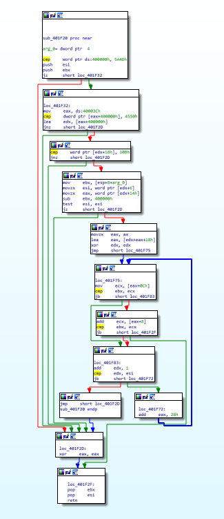
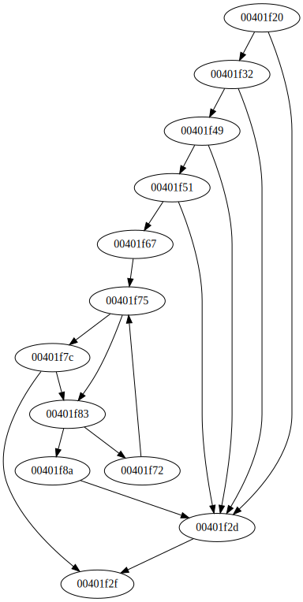

# ABAPT

 

ABAPT (Another Binary Analysis Python Tool) is a debugger and disassembler for PE.

## Limitations

- Probably many :)

## Examples

See <a href="demo.py">demo.py</a> for more examples with samples/chall.exe (check each flag char against harcoded value).

<table>
  <tr>
    <td colspan="2">Test debug</td>
  </tr>
  <tr>
    <td colspan="2" valign="center">Run with bp to overwrite ZF</td>    
  </tr>
  <tr>
    <td colspan="2">
    <pre>
[Debug] New process: PID 3088 starting at 004014e0
[Debug] Dll loaded: C:\WINDOWS\SysWOW64\KERNEL32.DLL at 772f0000
[Debug] Dll loaded: C:\WINDOWS\SysWOW64\KERNELBASE.dll at 76d00000
[Debug] Dll loaded: C:\WINDOWS\SysWOW64\msvcrt.dll at 75620000
[Debug] New thread: Handle 792 starting at 776663b0
[Debug] First exception: 776be9e2
[Debug] Get context 0x344
[Debug] Breakpoint at 00401741 added
[Debug] Breakpoint at 0040174e added
[Debug] Breakpoint at 0040175b added
[Debug] Breakpoint at 00401768 added
[Debug] Breakpoint at 00401775 added
[Debug] Breakpoint at 00401782 added
[Debug] Breakpoint at 0040178f added
[Debug] Set context 0x344
[Debug] Breakpoint at 00401741 triggered
[Debug] Get context 0x344
[Debug] Set context 0x344
[Debug] Breakpoint at 0040174e triggered
[Debug] Get context 0x344
[Debug] Set context 0x344
[Debug] Breakpoint at 0040175b triggered
[Debug] Get context 0x344
[Debug] Set context 0x344
[Debug] Breakpoint at 00401768 triggered
[Debug] Get context 0x344
[Debug] Set context 0x344
[Debug] Breakpoint at 00401775 triggered
[Debug] Get context 0x344
[Debug] Set context 0x344
[Debug] Breakpoint at 00401782 triggered
[Debug] Get context 0x344
[Debug] Set context 0x344
[Debug] Breakpoint at 0040178f triggered
[Debug] Get context 0x344
[Debug] Set context 0x344
[Debug] Thread exited with code: 0x0
Gratz man :)
[Debug] Process exited with code: 0x0
    </pre>
    </td>
  </tr>
  <tr>
    <td colspan="2" valign="center">Run with bp to overwrite mem</td>
  </tr>
  <tr>
    <td colspan="2">
    <pre>
[Debug] New process: PID 13244 starting at 004014e0
[Debug] Dll loaded: C:\WINDOWS\SysWOW64\KERNEL32.DLL at 772f0000
[Debug] Dll loaded: C:\WINDOWS\SysWOW64\KERNELBASE.dll at 76d00000
[Debug] Dll loaded: C:\WINDOWS\SysWOW64\msvcrt.dll at 75620000
[Debug] New thread: Handle 800 starting at 776663b0
[Debug] First exception: 776be9e2
[Debug] Get context 0x350
[Debug] Breakpoint at 0040172c added
[Debug] Set context 0x350
[Debug] Breakpoint at 0040172c triggered
[Debug] Get context 0x350
Hello I'm in a bp!
flag_addr = 00774ba8
Old flag is: foofooo 
New flag is: [redacted] 
[Debug] Set context 0x350
[Debug] Thread exited with code: 0x0
Gratz man :)
[Debug] Process exited with code: 0x0
    </pre>
    </td>
  </tr>
  <tr>
    <td colspan="2">Test CFG generation for chall.exe@0x40172c</td>
  </tr>
  <tr>
    <td  colspan="2" valign="center">
IDA
 
    
    </td>
    <td colspan="2" valign="center">
Tool
 
    
    </td>
  </tr>
</table>

